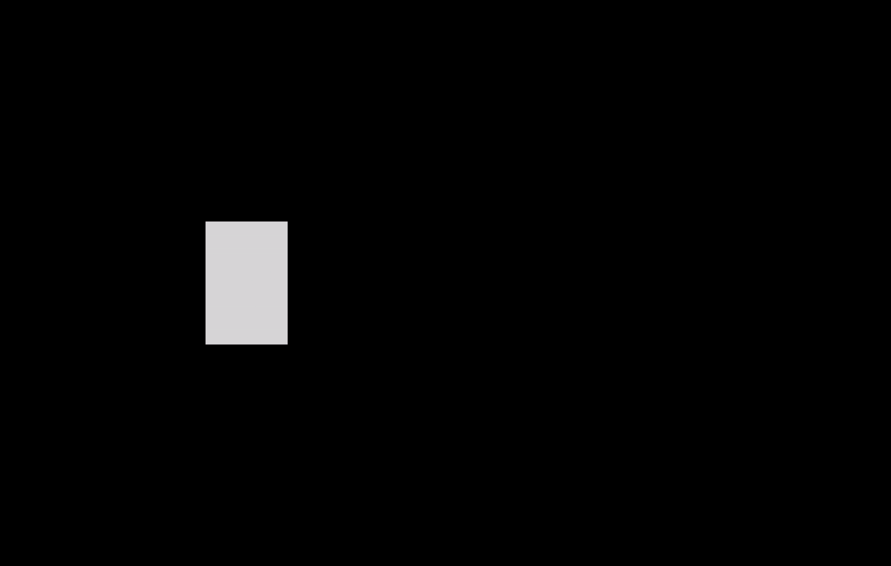
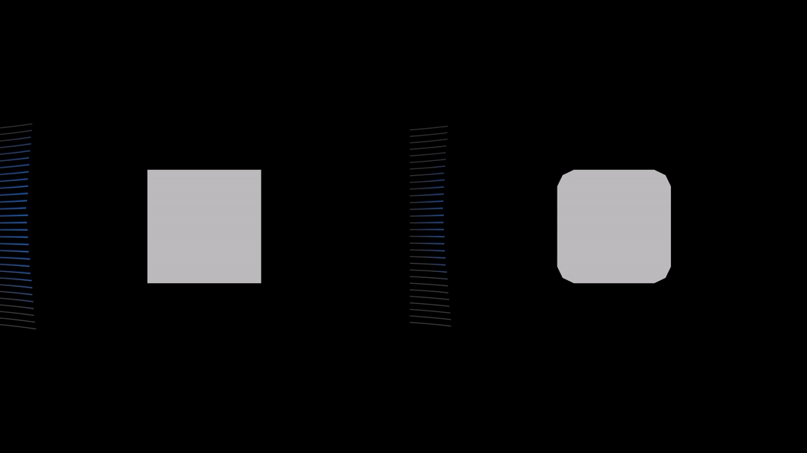

## Hi there, I am Chris 👋

I am interested in linking structural/wind engineering with computational methods such as CFD to improve efficiency and optimize designs.
I enjoy teaching others to leverage the computational tools that are openly available to them in order to improve their workflows.

### Flow Visualization
The following images are generating using a custom analysis pipeline which combines OpenFOAM, Paraview, and Blender.

The following gif shows the streamline progression around the building.

### Aerodynamic Optimization
A comparison of the flow around a square building and a building optimized to reduce the drag force. The custom optimization workflow uses a convolutional neural network (CNN) surrogate model coupled with a Genetic Algorithm to deterine the optimal shape. 

<!--
**chowlet5/chowlet5** is a ✨ _special_ ✨ repository because its `README.md` (this file) appears on your GitHub profile.

Here are some ideas to get you started:

- 🔭 I’m currently working on ...
- 🌱 I’m currently learning ...
- 👯 I’m looking to collaborate on ...
- 🤔 I’m looking for help with ...
- 💬 Ask me about ...
- 📫 How to reach me: ...
- 😄 Pronouns: ...
- ⚡ Fun fact: ...
-->
